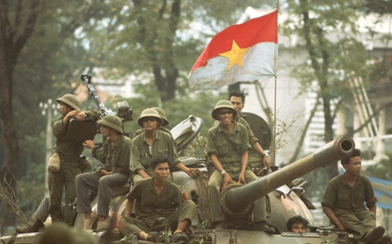

# Chiến tranh chống Mỹ - Trò chơi Xe tăng

Trò chơi chiến đấu xe tăng tái hiện các sự kiện lịch sử quan trọng trong cuộc chiến tranh Việt Nam (1955-1975). Người chơi điều khiển xe tăng Việt Nam qua các trận chiến lịch sử dẫn đến sự thống nhất đất nước.



## Động lực Phát triển

"Chiến tranh chống Mỹ - Trò chơi Xe tăng" không chỉ là một sản phẩm giải trí, mà còn là tâm huyết của chúng mình mong muốn bắc một nhịp cầu độc đáo nối liền niềm vui chơi game với những trang sử vàng son của dân tộc. Chúng mình khát khao tạo nên một không gian nơi mỗi trận chiến xe tăng không chỉ mang lại sự kịch tính, mà còn là cơ hội để người chơi, đặc biệt là thế hệ trẻ, được "chạm" vào lịch sử, cảm nhận và ghi nhớ những sự kiện trọng đại một cách tự nhiên và đầy hứng khởi.

Với triết lý "học mà chơi, chơi mà học", mục tiêu của chúng mình là:
*   **Thắp lửa đam mê lịch sử:** Biến những bài học có phần khô khan thành trải nghiệm tương tác sống động, giúp người chơi dễ dàng tiếp cận và yêu thích tìm hiểu quá khứ.
*   **Nuôi dưỡng niềm tự hào dân tộc:** Khơi gợi lòng tự hào về truyền thống đấu tranh bất khuất và sự biết ơn sâu sắc đối với những hy sinh to lớn của cha ông cho nền hòa bình, thống nhất hôm nay.
*   **Kết nối thế hệ:** Giúp các bạn trẻ hiểu thêm về những giai đoạn lịch sử quan trọng, từ đó thêm yêu quý và có ý thức gìn giữ những giá trị mà cha ông đã dày công vun đắp.

Hãy cùng chúng mình lên cỗ xe tăng thời gian, khám phá từng chương lịch sử hào hùng và cảm nhận trọn vẹn khí thế quật cường của quân và dân ta trong cuộc đấu tranh vĩ đại!

## Tính năng

- 5 màn chơi tiến triển dựa trên các trận chiến lịch sử
- Video clip và hình ảnh lịch sử giữa các màn chơi
- Cơ chế chiến đấu xe tăng với hệ thống bắn súng
- Độ khó tăng dần qua từng màn chơi
- Giao diện tiếng Việt hoàn toàn
- Chuỗi chiến thắng thể hiện quá trình thống nhất Việt Nam

## Yêu cầu hệ thống

- Python 3.6 trở lên
- pygame
- moviepy

## Cài đặt

1. Clone repository này:
```
git clone https://github.com/tranminhvu945/Game_KNNN.git
```

2. Cài đặt các gói yêu cầu:
```
pip install -r requirements.txt
```

## Cách chơi

1. Chạy trò chơi:
```
python main.py
```

2. Điều khiển:
   - Phím mũi tên: Di chuyển xe tăng
   - Phím cách: Bắn
   - P: Tạm dừng trò chơi
   - ESC: Thoát trò chơi

3. Lối chơi:
   - Tiêu diệt tất cả xe tăng địch để tiến đến màn chơi tiếp theo
   - Tránh đạn địch để duy trì lực lượng
   - Hoàn thành 5 màn chơi để chiến thắng

## Các màn chơi

1. **Điện Biên Phủ (1954)** - Trận chiến quyết định kết thúc thời kỳ thực dân Pháp
2. **Vĩ tuyến 17 (1954-1960s)** - Sự phân chia Việt Nam tại vĩ tuyến 17
3. **Tết Mậu Thân (1968)** - Cuộc tổng tấn công của quân đội Miền Bắc
4. **Chiến dịch Quảng Trị (1972)** - Trận chiến quan trọng trong Chiến dịch Xuân Hè
5. **Giải phóng Sài Gòn (30/4/1975)** - Trận chiến cuối cùng dẫn đến thống nhất đất nước

## Cấu trúc dự án

- main.py - Điểm khởi đầu của trò chơi
- src - Mã nguồn trò chơi chính
  - `game.py` - Vòng lặp trò chơi chính và khởi tạo
  - `entities/` - Các đối tượng trong trò chơi (anh hùng, kẻ địch, đạn, v.v.)
  - `systems/` - Các hệ thống trò chơi (va chạm, quản lý màn chơi, sinh sản)
  - `configs/` - Cấu hình và hằng số trò chơi
  - `helpers/` - Các chức năng tiện ích
- ui - Các thành phần giao diện người dùng
  - `screen/` - Màn hình trò chơi (menu chính, tạm dừng, kết thúc, v.v.)
  - `hud.py` - Hiển thị thông tin trong quá trình chơi
- assets - Tài nguyên trò chơi (hình ảnh, video, font chữ)